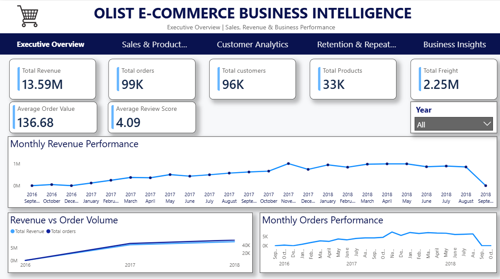
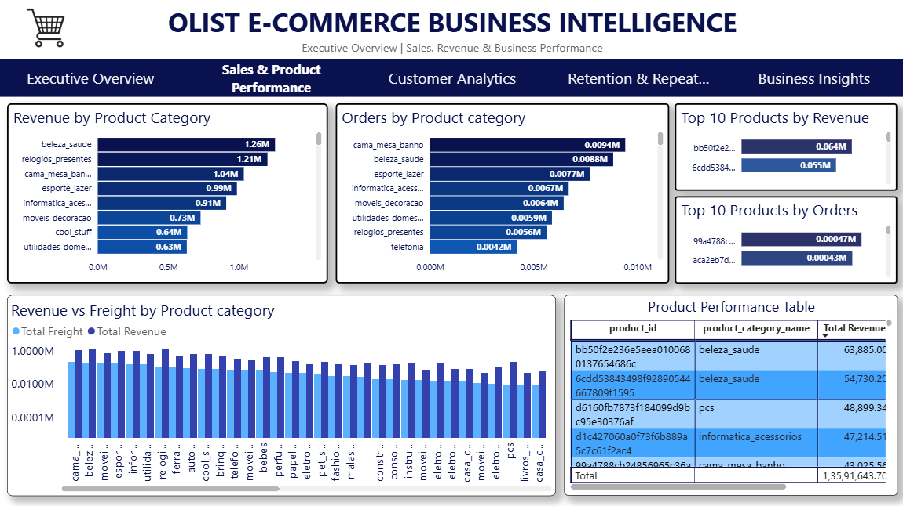
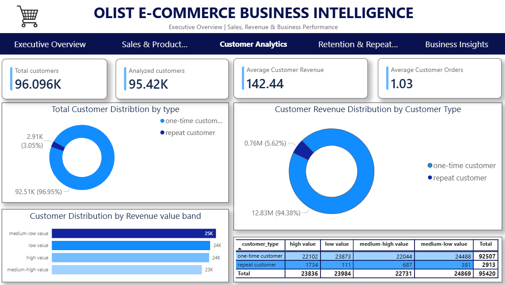
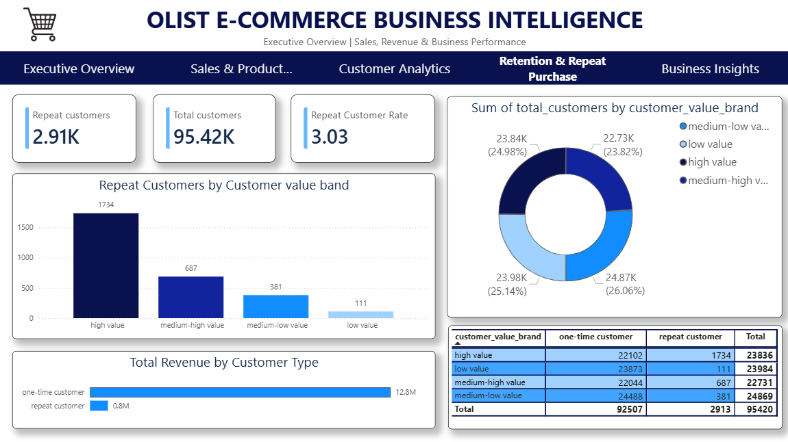
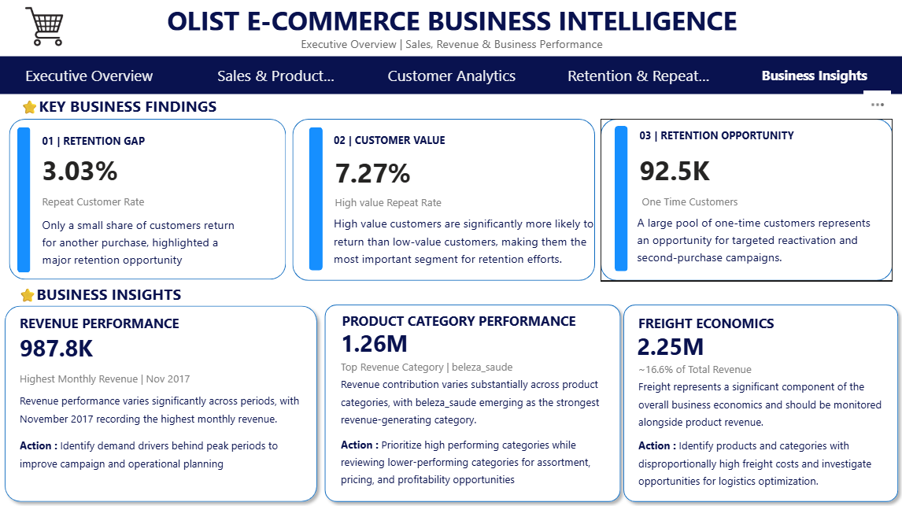

# E-Commerce Business Intelligence & Customer Analytics Platform

> An end-to-end e-commerce business intelligence and customer analytics project built using Python, Pandas, and Power BI to analyze sales performance, product performance, customer value, and repeat purchase behaviour.

---

## 📊 Dashboard Preview

### Executive Overview



### Sales & Product Performance



### Customer Analytics



### Retention & Repeat Purchase



### Business Insights



---

## 📌 Project Overview

This project analyzes the Brazilian Olist e-commerce dataset to understand overall business performance, sales and revenue trends, product and category performance, customer value, and repeat purchase behaviour.

The project follows an end-to-end analytics workflow:

**Data Audit → Data Cleaning & Validation → Sales Analysis → Customer Analytics → Customer Segmentation → Power BI Data Modelling & DAX → Interactive Dashboard → Business Insights & Recommendations**

The final solution combines Python-based data analysis with an interactive five-page Power BI Business Intelligence dashboard designed to support data-driven business decision-making.

---

## 🎯 Business Problem

E-commerce businesses generate large volumes of transactional and customer data, but raw data alone does not provide clear answers to important business questions.

This project aims to answer questions such as:

- How is the business performing overall?
- How are revenue and order volumes changing over time?
- Which product categories contribute most to revenue?
- How significant are freight costs relative to revenue?
- Who are the highest-value customers?
- What proportion of customers make repeat purchases?
- How does repeat purchase behaviour vary across customer value segments?
- What opportunities exist to improve customer retention?

---

## 🎯 Project Objectives

- Analyze overall sales and revenue performance.
- Identify monthly sales and revenue trends.
- Evaluate product and product-category performance.
- Analyze customer-level revenue and purchasing behaviour.
- Segment customers based on customer value.
- Compare one-time and repeat customers.
- Analyze repeat purchase behaviour across customer value segments.
- Build an interactive Power BI Business Intelligence dashboard.
- Translate analytical findings into actionable business recommendations.

---

## 🗂️ Dataset

**Dataset:** Brazilian Olist E-Commerce Dataset

The project uses multiple Olist datasets covering orders, order items, customers, products, payments, and reviews.

### Dataset Scale


| Dataset | Rows | Columns | Purpose |
|---|---:|---:|---|
| Orders | 99441 | 8 | Order status and order-level information |
| Customers | 99441 | 5 | Customer-level analysis (96096 unique customers)|
| Products | 32,952 | 9 | Product and category analysis |
| Payments | 103,887 | 5 | Payment and revenue analysis |
| Reviews | ~99,225 | 7 | Review analysis |

> **Note:** The exact dataset statistics should be verified against the final `01 Data Audit.ipynb` before publishing.

---

## 🔄 Project Workflow

```text
Raw Olist Dataset
        ↓
Data Audit
        ↓
Data Cleaning & Validation
        ↓
Sales Dataset Construction
        ↓
Sales & Revenue Analysis
        ↓
Customer-Level Analysis
        ↓
Customer Value Segmentation
        ↓
Repeat Purchase Analysis
        ↓
Power BI Data Modelling & DAX
        ↓
Interactive 5-Page Dashboard
        ↓
Business Insights & Recommendations
````

---

# 🧹 Data Preparation

The data preparation process included:

* Auditing the structure and quality of the available datasets.
* Reviewing dataset dimensions and data types.
* Identifying missing values.
* Handling missing product category information.
* Preparing cleaned datasets for downstream analysis.
* Validating the resulting datasets before conducting sales and customer analysis.

Detailed implementation is available in:

`notebooks/01_data_audit.ipynb`

`notebooks/02_data_cleaning.ipynb`

---

# 📈 Sales & Revenue Analysis

Sales analysis was performed using Python and Pandas to understand overall business performance and sales trends.

The analysis covered:

* Overall revenue performance.
* Order volume.
* Monthly revenue trends.
* Monthly order trends.
* Revenue versus order volume.
* Product-level performance.
* Product-category performance.
* Freight analysis.

### Key Sales Findings

* Revenue performance varies across months, indicating changes in sales demand over time. November 2017 recorded the highest monthly revenue in the analysis, with approximately 987.8K in revenue.

* Revenue contribution is not evenly distributed across product categories. Certain categories contribute significantly more to overall revenue, highlighting the importance of focusing on high-performing categories while evaluating weaker categories for improvement.

* Freight represents a significant component of the overall sales economics. Comparing freight with revenue across product categories can help identify categories where logistics costs may have a greater impact on overall business performance.

* Changes in revenue and order volume provide insight into the relationship between transaction activity and business performance. Monitoring both metrics together helps distinguish periods of high demand from periods where order volume and revenue behave differently.


Detailed analysis is available in:

`notebooks/03_sales_analysis.ipynb`

---

# 👥 Customer Analytics

Customer analytics was performed to understand customer purchasing behaviour, customer value, and repeat purchase patterns.

The analysis included:

* Customer-level analysis.
* Customer revenue analysis.
* Customer order behaviour.
* One-time versus repeat customer analysis.
* Customer value segmentation.
* Customer value bands.
* Customer value × customer type analysis.
* Repeat customer analysis.

The following processed datasets were created:

* `customer_level_analysis.csv`
* `customer_revenue_value_bands.csv`
* `customer_value_type_summary.csv`
* `repeat_customers_by_value_band_summary.csv`

Detailed analysis is available in:

`notebooks/04_customer_analytics.ipynb`

---

# 🔁 Retention & Repeat Purchase Analysis

Customer retention was analyzed by comparing one-time and repeat customers across different customer value segments.

### Customer Type

| Customer Type            | Customers |
| ------------------------ | --------: |
| One-time Customers       |   ~92,507 |
| Repeat Customers         |    ~2,913 |
| Total Analyzed Customers |   ~95,420 |

### Repeat Customer Rate by Value Band

| Customer Value Band | Repeat Customer Rate |
| ------------------- | -------------------: |
| High Value          |               ~7.27% |
| Medium-high Value   |               ~3.02% |
| Medium-low Value    |               ~1.53% |
| Low Value           |               ~0.46% |

The analysis indicates that high-value customers demonstrate substantially stronger repeat purchase behaviour than lower-value customer segments.

---

# 📊 Power BI Dashboard

The final Power BI dashboard consists of five pages designed to provide a progressive business analysis experience.

### Page 1 — Executive Overview

Provides a high-level view of:

* Total Revenue
* Total Orders
* Total Customers
* Total Products
* Total Freight
* Average Order Value
* Average Review Score
* Monthly Revenue Performance
* Monthly Orders Performance
* Revenue vs Order Volume

### Page 2 — Sales & Product Performance

Focuses on:

* Product-level performance
* Product performance table
* Revenue versus freight by product category
* Year-based analysis

### Page 3 — Customer Analytics

Focuses on:

* Total customers
* Customer-level metrics
* Customer type
* Customer value distribution
* Revenue by customer type
* Customer value × customer type analysis

### Page 4 — Retention & Repeat Purchase

Focuses on:

* Total customers
* Repeat customers
* Repeat customer rate
* Customer value segments
* Customer type distribution
* Repeat customer rate by customer value band

### Page 5 — Business Insights

Summarizes the major analytical findings and translates them into business-focused conclusions and recommendations.

---

# 💡 Key Business Insights

## 1. Customer Retention Opportunity

Repeat customers represent only a small proportion of the analyzed customer base, with an overall repeat customer rate of approximately **3.03%**.

This indicates a significant opportunity to improve customer retention and encourage second purchases.

---

## 2. High-Value Customers Show Stronger Repeat Behaviour

Repeat customer rates vary substantially across customer value bands.

The approximate repeat customer rates are:

* **High Value:** 7.27%
* **Medium-high Value:** 3.02%
* **Medium-low Value:** 1.53%
* **Low Value:** 0.46%

High-value customers demonstrate the strongest repeat purchase behaviour.

---

## 3. Large One-Time Customer Base

Approximately **92.5K customers** are classified as one-time customers within the analyzed customer population.

This represents a significant opportunity to convert existing one-time customers into repeat customers through targeted retention and re-engagement strategies.

---

## 4. Customer Value and Retention Are Closely Connected

The analysis indicates that higher-value customer segments have stronger repeat purchase behaviour.

This suggests that customer value can be an important factor when prioritizing retention strategies.

---

## 5. Revenue Performance Varies Over Time

Revenue performance changes across different months, with **November 2017** identified as the highest-revenue month in the analysis at approximately **987.8K**.

This suggests an opportunity to investigate seasonal or period-specific demand patterns.

---

## 6. Product Category Performance Is Uneven

Revenue contribution varies across product categories, indicating that some categories contribute significantly more to overall business performance than others.

This creates opportunities to prioritize strong-performing categories while investigating weaker category performance.

---

# 💼 Business Recommendations

Based on the analysis, the following actions are recommended:

### 1. Improve Second-Purchase Conversion

Develop targeted post-purchase engagement strategies to encourage one-time customers to make a second purchase.

### 2. Prioritize High-Value Customers

Implement loyalty, personalized offers, and retention initiatives focused on high-value customers, who demonstrate stronger repeat purchase behaviour.

### 3. Develop Customer Reactivation Strategies

Identify one-time customers with high potential value and target them with personalized re-engagement campaigns.

### 4. Leverage High-Performing Sales Periods

Investigate periods of strong revenue performance to identify seasonal demand patterns and use these insights for future promotional planning.

### 5. Monitor Product Category Performance

Prioritize high-performing categories while evaluating low-performing categories for potential improvement or strategic repositioning.

### 6. Monitor Freight Economics

Evaluate freight costs alongside category revenue to identify areas where logistics costs may have a significant impact on business performance.

---

# 🛠️ Technical Stack

* **Python**
* **Pandas**
* **NumPy**
* **Matplotlib**
* **Jupyter Notebook**
* **Power BI**
* **DAX**
* **Power BI Data Modelling**

---

# 📁 Project Structure

```text
Olist-Ecommerce-Business-Intelligence/
│
├── README.md
│
├── notebooks/
│   ├── 01_data_audit.ipynb
│   ├── 02_data_cleaning.ipynb
│   ├── 03_sales_analysis.ipynb
│   └── 04_customer_analytics.ipynb
│
├── processed_data/
│   ├── customer_level_analysis.csv
│   ├── customer_revenue_value_bands.csv
│   ├── customer_value_type_summary.csv
│   └── repeat_customers_by_value_band_summary.csv 
│
├── dashboard/
│   ├── 01_executive_overview.png
│   ├── 02_sales_product_performance.png
│   ├── 03_customer_analytics.png
│   ├── 04_retention_repeat_purchase.png
│   └── 05_business_insights.png
│
└── powerbi/
    └── Olist_Ecommerce_Business_Intelligence.pbix
```

---

# 📌 Key Project Metrics


| Metric               |  Value |
| -------------------- | -----: |
| Total Revenue        | 13.59M |
| Total Orders         |    99K |
| Total Customers      |    96K |
| Total Products       |    33K |
| Total Freight        |  2.25M |
| Average Order Value  | 136.68 |
| Average Review Score |   4.09 |
| Repeat Customers     | ~2.91K |
| Repeat Customer Rate | ~3.03% |

> **Important:** Validate these values against the final Power BI dashboard before publishing.

---

# 🚀 Future Improvements


Potential future improvements include:

* Incorporating additional customer behavioural data.
* Adding marketing campaign data to measure campaign effectiveness.
* Building predictive customer churn models.
* Developing customer lifetime value prediction.
* Adding automated data refresh pipelines.
* Deploying the analytics solution as a production BI workflow.

---

# 👤 Author

Name :- **Jayveer Talekar**

B.Tech Artificial Intelligence & Data Science

**GitHub:** https://github.com/jayveertalekar0

**LinkedIn:** https://www.linkedin.com/in/jayveer-talekar

---

## ⭐ Project Highlights

* End-to-end e-commerce business intelligence project.
* Python and Pandas-based data analysis.
* Customer value segmentation and retention analysis.
* Repeat purchase behaviour analysis.
* Power BI data modelling and DAX.
* Five-page interactive Business Intelligence dashboard.
* Business insights translated into actionable recommendations.
